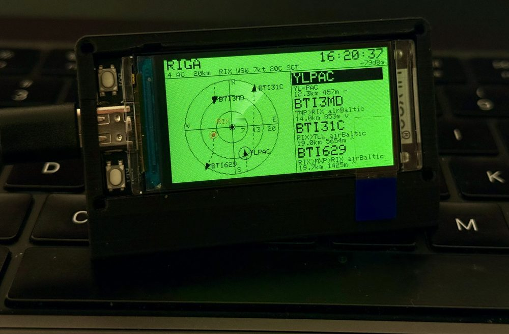
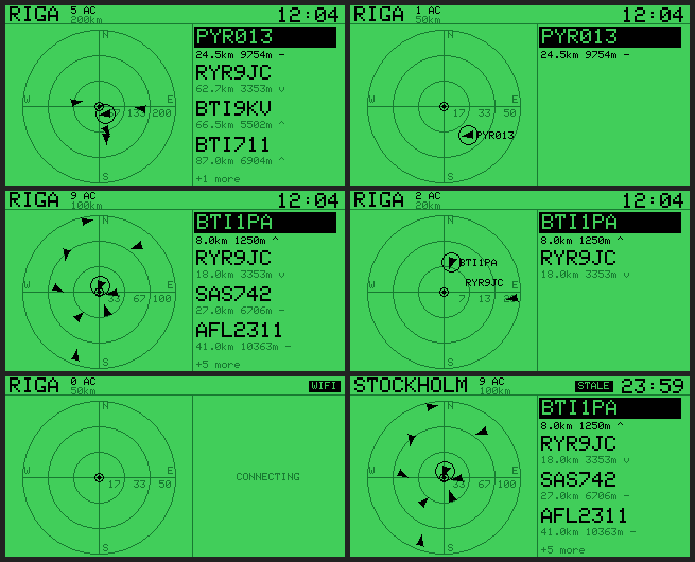

# Flydar

A live flight radar for your desk. It shows the aircraft actually overhead
right now: where they are, where they came from, and where they're going.

Runs standalone on a LilyGO T-Display-S3. Plug it into any USB charger and it
works. No computer, no cloud account, no companion app, no API keys.

<p align="center">
  
</p>

## What's on screen



- **Radar**, north up, on labelled distance rings, with a rotating sweep.
- **Aircraft** as arrowheads pointing along their real track, each trailing a
  dashed line of where it has been for the last couple of minutes. Between
  fetches they glide along their own heading, so the picture never freezes.
- **Side panel** with the nearest aircraft: callsign, route and airline
  (`RIX>ARN airBaltic`), distance, altitude in metres, and climbing /
  descending. When more are in range than fit, it says how many more.
- **Airport** in red, with its current weather in the header
  (`RIX SSW 4kt 19C BKN`).
- **Home** in blue (optional). When something passes within 3 km of it, a blue
  chip across the top tells you what's above you.
- **Status** in the header: `CONNECTING`, `STALE`, `NO DATA` or `NO WIFI`, plus
  the WiFi signal strength.

## You need

| | |
|---|---|
| [LilyGO T-Display-S3](https://github.com/Xinyuan-LilyGO/T-Display-S3) | ESP32-S3 with a 1.9" 320×170 screen. The non-touch version is fine. Both buttons used are on the board. |
| USB-C cable | For flashing, then for power. Any phone charger will run it. |
| 2.4 GHz WiFi | **5 GHz won't work.** The ESP32-S3 only has a 2.4 GHz radio. |
| [PlatformIO](https://platformio.org/install) | The CLI, or the VS Code extension. |

## Getting started

**1. Get the code.**

```bash
git clone https://github.com/TDMarko/flights-status-display.git
cd flights-status-display
```

**2. Add your WiFi.** Copy the template:

```bash
cp src/secrets.h.example src/secrets.h
```

Then edit `src/secrets.h`:

```c
#define WIFI_SSID "your-network"
#define WIFI_PASS "your-password"

// Optional: where you are, for the blue home marker and the
// "something is overhead" alert. Leave these out to turn that off.
// #define HOME_LAT 56.9496
// #define HOME_LON 24.1052
```

> **2.4 GHz only.** The ESP32-S3 has no 5 GHz radio, so it can't join a 5 GHz
> network. If your router puts both bands under one name, that usually works:
> the board just connects on 2.4 GHz. If it only offers 5 GHz, or 2.4 GHz is
> turned off, enable a 2.4 GHz network (many routers can add a separate one,
> such as `home-2g`) and use that name here.

`secrets.h` is git-ignored, so your password and your address stay on your
machine and on the board.

**3. Pick your city.** Riga is the default. To start somewhere else, move your
city to the top of the `CITIES` table in `src/config.h`, or add a new one (see
[Making it yours](#making-it-yours)). You can also just press BOOT on the board
to cycle through the list.

**4. Flash it.** Plug in the board, then:

```bash
pio run -t upload
pio device monitor        # optional: shows what it's fetching
```

The first build downloads the ESP32 toolchain and takes a few minutes. After
that it's quick.

> `pio: command not found`? The VS Code extension installs it at
> `~/.platformio/penv/bin/pio`. Either use that path or add it to your `PATH`.

**5. Watch it come up.** The empty scope appears immediately with
`CONNECTING`. Within a few seconds it joins WiFi, sets the clock, and the
traffic and weather fill in. Routes appear a few seconds after each aircraft,
one lookup at a time.

## Buttons

| Button | Does |
|---|---|
| **BOOT** (GPIO0) | Next city: Riga, Vilnius, Tallinn, Kaunas, Helsinki, Stockholm, Warsaw. |
| **GPIO14** (the other button) | Next range: 20 / 50 / 100 / 200 km. |

Both are saved to flash, so after a power cut it comes back where you left it.

## Troubleshooting

| Symptom | Try |
|---|---|
| Upload fails with a serial sync error | Hold **BOOT**, tap **RST**, release **BOOT**, then upload again. Close any open serial monitor first. |
| `NO WIFI` | Check the SSID and password in `secrets.h` (both are case-sensitive), and make sure the network is on 2.4 GHz. A 5 GHz-only network never shows up for the board. |
| Header shows a weak signal (around `-80dBm` or worse) | It will still work, just more slowly: below that it polls less often and skips route lookups. Moving the board closer to the router helps most. |
| Radar is empty | Coverage comes from volunteer receivers, so some areas are thin. Try a wider range, or check [adsb.lol](https://adsb.lol) for your area. |
| Clock is an hour or two off | Set `TZ_STRING` in `src/config.h` to your timezone. The default is Latvia. |
| Screen stays black | Make sure it's the T-Display-S3 (not the original T-Display). Other boards need `src/display_config.h`. |

`pio device monitor` prints each fetch, the signal strength, the frame rate
and free memory, which is usually enough to see what's wrong.

## Making it yours

Everything is in `src/config.h`.

**Cities.** Each row of the `CITIES` table is a city and its main airport. The
first row is the default:

```c
//  name   city centre        IATA   ICAO    airport position
{"RIGA", 56.9496, 24.1052, "RIX", "EVRA", 56.9236, 23.9711},
```

Keep names to about ten characters. The ICAO code is what the weather is
looked up by. `pio test -e native` checks every row, so a mistyped coordinate
fails a test instead of drawing an airport in the wrong country.

**Colours.** The default is a green ground with black data. Uncomment
`CLASSIC_SCHEME` for the traditional black background with green data.

**Everything else.** Ranges, sweep speed, trail length, poll intervals, the
overhead radius and the timezone are all named constants in the same file,
each with a comment explaining it.

## Privacy

The board makes only these requests:

- the **city centre** and range, to adsb.lol, for the aircraft;
- each nearby **callsign**, to adsb.lol's route files;
- the **airport's ICAO code**, to aviationweather.gov, for the weather;
- a time request to `pool.ntp.org`, for the clock.

Your home coordinates never leave the device. They're used only on the board,
to draw the marker and check what's overhead. The three data requests are
HTTPS, and the certificates are checked against roots built into the firmware.

## Where the data comes from

- **Aircraft:** [adsb.lol](https://adsb.lol), free and community-fed, no key
  needed. Please keep the polling interval polite; the default is every 10
  seconds.
- **Routes:** adsb.lol's route files, plus a built-in table of airline codes.
- **Weather:** [aviationweather.gov](https://aviationweather.gov) METARs (NOAA).

## Developing

```bash
pio test -e native                    # 87 unit tests, run on your computer
sh tools/preview/build.sh             # render the UI without a board
python3 tools/preview/montage.py .preview
```

The preview compiles the real drawing code against a stand-in for the display,
using the same font as the panel, and writes `.preview/montage.png` (the image
above). It's how the layout gets checked before anything is flashed.

On macOS the host build needs Xcode's command-line tools. If every test fails
to compile with a licence message, run `sudo xcodebuild -license` once.

| Path | What's there |
|---|---|
| `src/main.ino` | WiFi, the fetch task (on its own core) and the render loop |
| `src/radar_ui.*` | All drawing |
| `src/adsb.*`, `routes.*`, `weather.*` | Parsing the three feeds, Arduino-free and unit-tested |
| `src/geo.*`, `trails.*` | Projection, dead reckoning and history trails |
| `src/config.h` | Everything you'd want to change |
| `src/display_config.h` | Panel wiring, for porting to another board |
| `test/` | Host unit tests and captured API fixtures |
| `tools/preview/` | The host renderer behind the screenshots |

Porting to another ESP32 with an ST7789 or ILI9341 panel means editing
`src/display_config.h`. The layout in `config.h` assumes a 320×170 screen.

## Licence

MIT. See [LICENSE](LICENSE).
